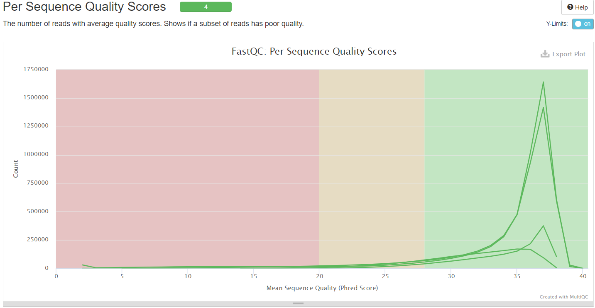
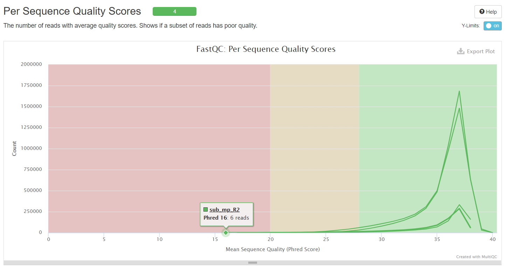

# Домашнее задание № 1

###### Кличко Никита

## Список команд, выполненных на сервере:
```
mkdir nkhw1
ln -s /usr/share/data-minor-bioinf/assembly/oil_R1.fastq
ln -s /usr/share/data-minor-bioinf/assembly/oil_R2.fastq
ln -s /usr/share/data-minor-bioinf/assembly/oilMP_S4_L001_R1_001.fastq
ln -s /usr/share/data-minor-bioinf/assembly/oilMP_S4_L001_R2_001.fastq
seqtk sample -s810 oil_R1.fastq 5000000 > sub_pe_R1.fastq
seqtk sample -s810 oil_R2.fastq 5000000 > sub_pe_R2.fastq
seqtk sample -s810 oilMP_S4_L001_R1_001.fastq 1500000 > sub_mp_R1.fastq
seqtk sample -s810 oilMP_S4_L001_R2_001.fastq 1500000 > sub_mp_R2.fastq
mkdir fastqc 
ls -1 sub_mp_R1.fastq sub_mp_R2.fastq sub_pe_R1.fastq sub_pe_R2.fastq  |   xargs  -P 1 -tI{} fastqc -o fastqc {}
mkdir multiqc
multiqc -o multiqc fastqc
platanus_trim  sub_pe_R1.fastq sub_pe_R2.fastq
mkdir trimmed_fastq
mv -v *trimmed trimmed_fastq/
platanus_internal_trim sub_mp_R1.fastq sub_mp_R2.fastq
ls trimmed_fastqc/* | xargs -P 1  -tI{} fastqc -o trimmed_fastq {}
mkdir trimmed_fastqc
mv *.html trimmed_fastqc/
mv *.zip trimmed_fastqc/
mkdir trimmed_multiqc
screen -S nik_plat
time platanus assemble -o Poil -t 4 -m 28 -f trimmed_fastqc/sub_pe_R1.fastq.trimmed trimmed_fastqc/sub_pe_R2.trimmed 2> asseble.log
ctrl+a ctrl+d
tail -f asseble.log
screen -r nik_plat 
exit
exit
screen -S nik_sc
time platanus scafold -o Poil -t 4 -c Poil_contig.fa -IP1 trimmed_fastq/sub_pe_R1.fastq.trimmed trimmed_fastq/sub_pe_R2.fastq.trimmed -OP2 trimmed_fastq/sub_mp_R1.fastq.int_trimmed trimmed_fastq/sub_mp_R2.fastq.int_trimmed 2>sacffold.log
time platanus gap_close -o Poil -t 4 -c Poil_scaffold.fa -IP1 trimmed_fastq/sub_pe_R1.fastq.trimmed trimmed_fastq/sub_pe_R2.fastq.trimmed -OP2 trimmed_fastq/sub_mp_R1.fastq.int_trimmed trimmed_fastq/sub_mp_R2.fastq.int_trimmed 2> gapclose.log
exit
exit
```
## Отчеты MultiQC
### Для исходных чтений
[Ссылка](https://htmlpreview.github.io/?https://github.com/NikitaKlichko/hse21_hw1/blob/main/multiqc.html)

### Для подрезанных чтений
[Ссылка](https://htmlpreview.github.io/?https://github.com/NikitaKlichko/hse21_hw1/blob/main/multiqc_trimmed.html)

## Код в Jupyter Notebook
[Код здесь](https://github.com/NikitaKlichko/hse21_hw1/blob/main/src/code_hw1.ipynb)
## Результаты рассчетов
### Для контигов
Общее количество: 628  
Общая длина: 3926426  
Максимальная длина: 179307  
N50: 52799  
### Для скаффолдов
Общее количество: 71  
Общая длина: 3876285  
Максимальная длина: 3836599  
N50: 3836599  
### Подсчет гэпов для самого длинного скаффолда
#### До gap_close
Число: 146  
Общая длина: 6561  
#### После gap_close  
Число: 27  
Общая длина: 1789  
